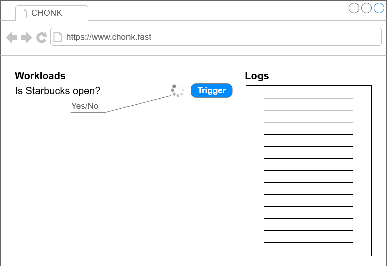

CHONK: Can't Help Over-engineering New Krap
==============================================

This is a pet project where I want to see how far I can hilariously over-engineer a common task but still produce something that is  architecturally sane. The idea came one late evening when my better half wanted to a simple yes/no answer to whether or not Starbucks is still open.

Why build a simple script that crawls [starbucks.com](https://www.starbucks.com) for an answer that _I_ have to run when I can over-engineer the krap out of a system to do it _for me_?

I took to our amazing pet hedgehog for inspiration. The same way she can run incredibly fast & smooth despite her physics-defying round shape and the 30-odd worms she ate moments prior, _I too_ can build a system that performs reasonably well _in spite of_ being bloated with all kinds of architectural patterns and components.

## The Gist of What
The gist of CHONK is that:
- it is deployed in a fully containerized environment
- it enables triggering containerized workloads on the same environment
- it provides some sort of introspection into the each workload via simple real-time logging

> _e.g._  
Triggering the _"Is Starbucks open?"_ workload could deploy a container which scrapes starbucks.com for an answer.  
Upon completion, the container reports back **Yes/No** (or possibly fails).

## The Gist of How
CHONK will run over a k8s cluster.

There's going to be three major architectural components:
1. the CHONK **client** — will provide a convenient way to interact with CHONK  
(_very light JS client written in TypeScript and bundled with webpack_)
2. the **CHONK itself** which consists of:
    - **Chonk.Web** — simple ASP.NET Core API that exposes CHONK's functionality
    - **Chonk.Brain** — a simple kube client  
    (_i.e. lets CHONK talk to a k8s cluster_)
    - **Chonk.Service** — quality-of-life services  
    (_e.g. circuit breaking, caching, etc._)
3. the CHONK **workloads** — these will simply custom containers built for a specific purpose that CHONK can deploy  
(_e.g. a Python script that scrapes the web_)

But, but... **what about persistence**?  
Considering that my hedgehog forgets who I am on a daily basis, implementing any sort of persistence would make me feel I'm straying away from my source of inspiration. I'm only going to bother with temporary caching.